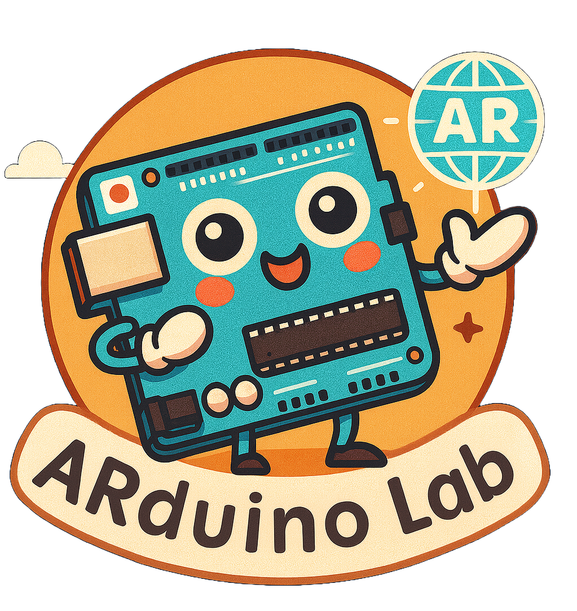

<div align="center">
  
  
  # ARduino Lab
  
  A Meta Quest 3 immersive application for Arduino component detection, project ideation, and step-by-step instruction generation using OpenAI Vision API and passthrough camera technology.
</div>

## Overview

**ARduino Lab** combines augmented reality with artificial intelligence to help users:
- **Detect Arduino components** from live camera feeds using computer vision
- **Generate project ideas** based on available components
- **Create step-by-step instructions** for building Arduino projects
- **Manage an inventory** of components in an intuitive 3D interface

## Features

### 🎥 Camera Integration
- Real-time passthrough camera feed on Meta Quest 3
- Zone selection for focused component detection
- WebCam texture management and frame capture

### 🤖 AI-Powered Analysis
- OpenAI GPT-4O Vision model integration
- Automatic component identification from images
- JSON-structured response parsing
- Project suggestion engine based on available components
- Image generation for instruction step illustrations using OpenAI image model `gpt-image-1-mini`
- Instruction and project text generation using `gpt-4.1-mini`

### 📦 Inventory Management
- Persistent component storage
- Pagination support for large inventories
- Manual component addition
- Real-time component quantity tracking

### 🎨 UI/UX
- Debug UI builder for immersive debugging
- Rolling loading animations
- Two-pane responsive layout (LEFT/RIGHT panes)
- Touch-friendly navigation for VR

## Project Structure

```
Assets/
├── Scenes/
│   ├── StartScene/           # Initial menu and setup
│   ├── ProjectAssistant/     # Main application scene
│   ├── SelectProject/        # Project selection UI
│   ├── CameraToWorld/        # Camera calibration
│   └── ...
├── Resources/
│   ├── secrets/              # API keys (git-ignored)
│   ├── icons/                # UI icons and buttons
│   ├── rolling/              # Loading animation frames (30 sprites)
│   ├── projects.json         # Project database
│   ├── tips.json             # Tips and hints
│   └── 2dmod/, 3dmod/        # 3D models for components
├── Plugins/
│   └── Android/              # Android manifest for Quest
└── StreamingAssets/
```

## Key Scripts

### Core Components
- **`ArduinoImageOpenAIConnector.cs`** – Handles OpenAI Vision API requests and responses
- **`ComponentsScreen.cs`** – Manages inventory UI and camera zone selection
- **`WebCamTextureManager.cs`** – Manages passthrough camera texture and frame capture
- **`RollingAnimationLoader.cs`** – Displays loading animations

### UI & Navigation
- **`DebugUIBuilder.cs`** – Dynamic UI element creation for immersive debugging
- **`StaticClass.cs`** – Global state management (inventory, selected projects)

### Data Models
- **`Component.cs`** – Individual Arduino component representation
- **`OpenAIVisionModel`** enum – Supported GPT models (GPT-4O, GPT-4 Mini)

## Setup & Configuration

### Prerequisites
- Meta Quest 3 headset
- OpenAI API key (GPT-4 Vision access)
- Unity 2022.3 LTS or later
- Meta XR SDK

### Installation

1. **Clone the repository:**
   ```bash
   git clone <repo-url>
   cd ARduino\ Lab
   ```

2. **Configure API Key:**
   - Create `Assets/Resources/secrets/api_key.txt`
   - Add your OpenAI API key (one line only)
   - Ensure `.gitignore` includes `secrets/`

3. **Import Meta XR SDK:**
   - Window → TextMesh Pro → Import TMP Essential Resources
   - Window → XR Plugin Management → Install XR Plugin Management

4. **Build for Quest 3:**
   - File → Build Settings
   - Select Android as target platform
   - Enable Development Build for console debugging

## Usage

### In Editor
- Open the `StartScene`
- Press Play to test UI flows
- Use Android Logcat window to view console output

### On Quest 3
1. Build and deploy the APK
2. Launch the app
3. Navigate through:
   - **Start Options** → Select interaction mode
   - **Project Assistant** → Scan components or add manually
   - **Component Inventory** → View and manage components
   - **Project Suggestions** → Get AI-generated project ideas

### Camera Zone Selection
1. Tap "Define Zone" in the Components Screen
2. Drag to select the area containing Arduino components
3. Tap "Scan Using Camera" to analyze only the selected region

## API Integration

### OpenAI Vision Request

```json
{
  "model": "gpt-4o",
  "max_tokens": 300,
  "messages": [
    {
      "role": "user",
      "content": [
        { "type": "text", "text": "Identify Arduino components..." },
        { "type": "image_url", "image_url": { "url": "data:image/jpeg;base64,..." } }
      ]
    }
  ]
}
```

### Expected Response

```json
{
  "components": [
    { "name": "Arduino Uno", "quantity": 1, "category": "microcontroller" },
    { "name": "LED", "quantity": 5, "category": "light" }
  ]
}
```

## Debugging

### View Logs on Quest 3

```bash
# Use Android Logcat in Unity:
Window → TextMesh Pro → Android Logcat

# Or via command line:
adb logcat | grep Unity
```

### Common Issues
- **API Key Not Found:** Check `Resources/secrets/api_key.txt` exists and is readable
- **No Components Detected:** Ensure good lighting and clear component visibility
- **Animation Too Slow:** Reduce `frameDelay` in `RollingAnimationLoader.LoadRollingAnimation()`

## Performance Optimization
- **Image Compression:** JPG quality set to 90 for balance between quality and transmission speed
- **Pagination:** Components displayed 3 per page to optimize rendering
- **Async Coroutines:** API calls use coroutines to prevent frame drops

## Future Enhancements
- [ ] Local component recognition (edge ML)
- [ ] Real-time component placement in AR
- [ ] Project build tracking and validation
- [ ] Community project sharing
- [ ] Multi-language support

## License
See `LICENSE.txt`

## Contact & Support
- **Author:** Gabriel Armas
- **Organization:** Concordia University
- **Project:** ARduino Lab

For issues or feature requests, please open an issue in the repository.